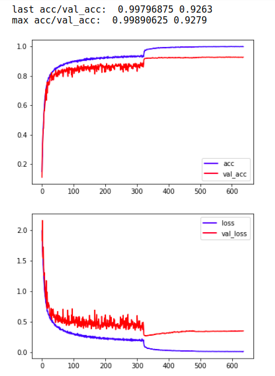

## resnet_cifar10_pytorch

> tinyalpha	
>
> tinyalpha@protonmail.com

#### training

* run `python3 train.py`
* it takes tens of minutes to train on titan x (pascal)
* there are weights and logs I have trained in `bak`

#### results

* it can get at most 92.79% accuracy with the default hyperparameters, which is slight higher than the [origin paper](https://arxiv.org/abs/1512.03385)'s result (92.49%)

* training curve is shown below:

  

#### dependency

* python 3.6.5
* pytorch 0.4.0
* matplotlib 2.2.2